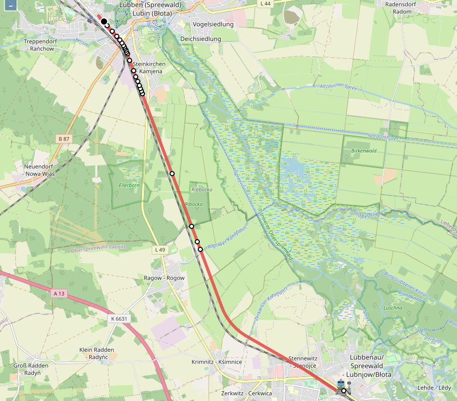

# Visualisierung für den simulierten Zugverkehr

Dieses Projekt ist Teil einer Bachelorarbeit und visualisiert in einem Browserfenster Daten aus der BerDiBa-Simulationsumgebung (Simulink).

## Installation

Die Software benötigt die Node.js JavaScript-Laufzeitumgebung. Diese kann hier bezogen werden:

[Download Node.js](https://nodejs.dev/)

Nach Installation, den Node-Paketmanager alle Module laden lassen:
```
npm install
```

Anschließend das Programm starten und dem Link aus der Konsole folgen:
```
npm start
```

## Screenshot der Visualisierung: Lübbenau nach Lübben



## Third party libaries

- [Open Layers](https://github.com/openlayers/openlayers)

## License

    MIT License

    Copyright (c) 2021 Felix F.

    Permission is hereby granted, free of charge, to any person obtaining a copy
    of this software and associated documentation files (the "Software"), to deal
    in the Software without restriction, including without limitation the rights
    to use, copy, modify, merge, publish, distribute, sublicense, and/or sell
    copies of the Software, and to permit persons to whom the Software is
    furnished to do so, subject to the following conditions:

    The above copyright notice and this permission notice shall be included in all
    copies or substantial portions of the Software.

    THE SOFTWARE IS PROVIDED "AS IS", WITHOUT WARRANTY OF ANY KIND, EXPRESS OR
    IMPLIED, INCLUDING BUT NOT LIMITED TO THE WARRANTIES OF MERCHANTABILITY,
    FITNESS FOR A PARTICULAR PURPOSE AND NONINFRINGEMENT. IN NO EVENT SHALL THE
    AUTHORS OR COPYRIGHT HOLDERS BE LIABLE FOR ANY CLAIM, DAMAGES OR OTHER
    LIABILITY, WHETHER IN AN ACTION OF CONTRACT, TORT OR OTHERWISE, ARISING FROM,
    OUT OF OR IN CONNECTION WITH THE SOFTWARE OR THE USE OR OTHER DEALINGS IN THE
    SOFTWARE.
